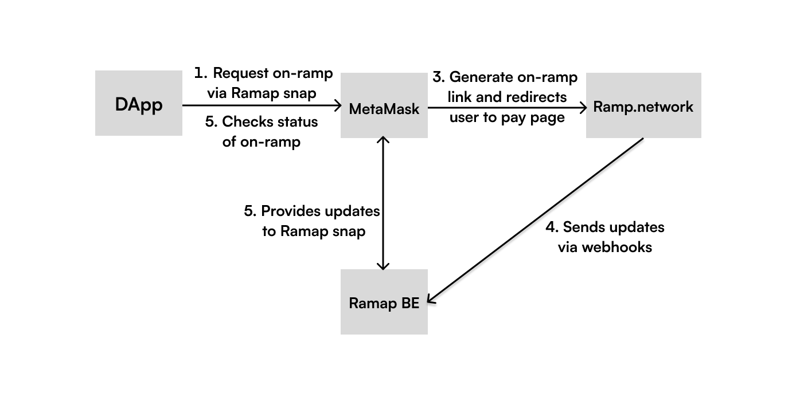

## Ramap


Ramap is MetaMask snap that allow any DApp to benefit from on-ramp functionality provided by ramp.network

### Architecture:


Ramap BE is running as Google cloud function with firebase storage.

### Development
To serve snap locally:
```shell
cd snap
yarn && yarn build
yarn serve
```
This would serve a snap locally, so you could access it from other local running DApps using `snapId = 'local:http://localhost:8080'`


Example implementation with AAVE:
https://github.com/vlad324/aave-interface